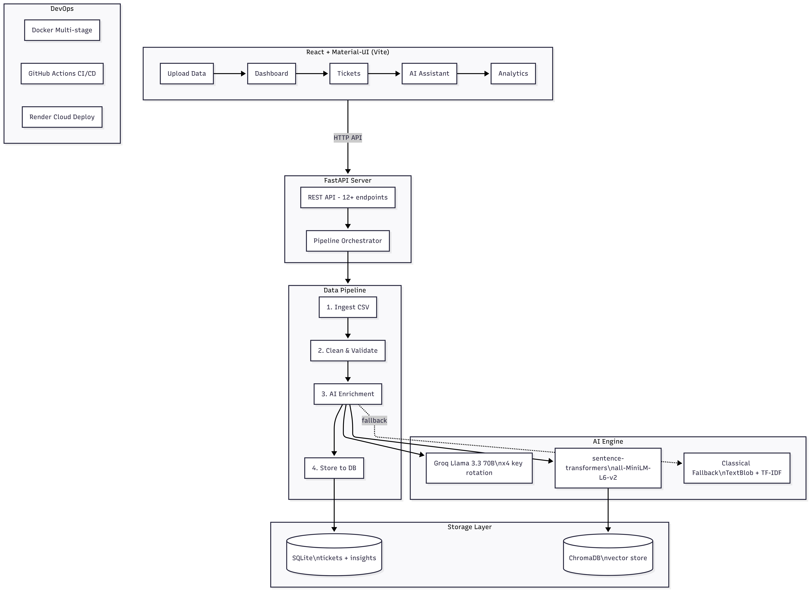

# AI-Powered Customer Support Insight Platform

## Submission Document

**Author:** Karishma Bhatia
**Repository:** [github.com/karishb/AISupportSystem](https://github.com/karishb/AISupportSystem)
**Live Demo:** [aisupportsystem.onrender.com](https://aisupportsystem.onrender.com)
**Date:** March 2026

---

## Table of Contents

1. [Project Overview](#1-project-overview)
2. [AI Choices & Approach](#2-ai-choices--approach)
3. [Data Model](#3-data-model)
4. [System Architecture](#4-system-architecture)
5. [Data Pipeline](#5-data-pipeline)
6. [Software Development](#6-software-development)
7. [DevOps & Deployment](#7-devops--deployment)
8. [Scalability](#8-scalability)
9. [Tradeoffs](#9-tradeoffs)
10. [Business Thinking](#10-business-thinking)
11. [Bonus Features](#11-bonus-features)

---

## 1. Project Overview

### Problem Statement

A mid-sized e-commerce company receives thousands of customer support messages daily through chat, email, and tickets. The company struggles to understand what customers are complaining about, which issues are increasing, which problems affect revenue the most, and how support agents should respond.

### Solution

A full-stack AI-powered platform that:
- **Ingests** customer support tickets (CSV upload or synthetic generation)
- **Processes** them through a 4-stage data pipeline (ingest, clean, enrich, store)
- **Analyzes** each ticket using Groq's Llama 3.3 70B LLM for categorization, sentiment analysis, and response generation
- **Stores** results in SQLite with vector embeddings in ChromaDB
- **Displays** actionable insights via a React dashboard with 5 interactive pages

### Dataset

- **Primary:** Kaggle Customer Support Ticket Dataset (8,469 real tickets)
  - Source: `suraj520/customer-support-ticket-dataset`
  - Fields: Ticket ID, Customer Name, Product Purchased, Ticket Type, Ticket Description, Resolution, Channel, Priority, Satisfaction Rating, and more
- **Secondary:** Synthetic data generator (5,000 tickets via Faker library)
- **Schema mapping:** Auto-detects Kaggle format, standard format, or generic CSVs

### Tech Stack

| Layer | Technology | Purpose |
|-------|-----------|---------|
| Backend | FastAPI 0.109 + Uvicorn | REST API server with 16+ endpoints |
| Frontend | React 18 + Vite + Material-UI | 5-page SPA with Recharts visualizations |
| LLM | Groq Llama 3.3 70B (free tier) | Ticket categorization, sentiment, response generation |
| Embeddings | sentence-transformers/all-MiniLM-L6-v2 | 384-dim vectors for semantic similarity |
| Vector DB | ChromaDB 0.4.22 | HNSW cosine indexing for RAG retrieval |
| Database | SQLite + SQLAlchemy ORM | Structured storage for tickets and insights |
| Classical ML | TextBlob + keyword scoring | Fallback when LLM unavailable |
| Deployment | Docker + Render + GitHub Actions | Containerized cloud deployment with CI/CD |

---

## 2. AI Choices & Approach

### Why This Multi-Model Architecture

The assignment suggests using LLM APIs, embeddings, vector databases, classical ML, and prompt engineering. Our system uses **all five** in a layered approach:

### 2.1 LLM: Groq Llama 3.3 70B

**Why Groq over OpenAI:**
- Free tier with generous limits (30 req/min, 100k tokens/day per key)
- Sub-second inference via Groq's LPU (Language Processing Unit) hardware
- OpenAI-compatible API (same client library, easy to swap)
- Llama 3.3 70B matches GPT-4o quality for classification tasks

**How we use it:**
1. **Combined Categorization + Sentiment** (1 API call per ticket): A structured JSON prompt asks the LLM to return category, confidence, sentiment, frustration score, and reasoning in a single response. This saves 33% of API quota vs separate calls.
2. **Response Generation** (1 API call per ticket): Generates a 2-3 sentence empathetic agent response, with RAG context from similar resolved tickets injected into the prompt.

**Prompt Engineering:**
- System prompt enforces JSON-only output with specific field names
- Category validation against 8 predefined categories (Billing Inquiry, Technical Issue, Product Inquiry, Refund Request, Account Access, Shipping Issue, Cancellation, General Inquiry)
- Temperature=0 for classification (deterministic), temperature=0.7 for responses (creative)
- Message truncation to 1,000 chars for classification, 500 for responses

**Multi-Key Rotation (Cost Optimization):**
- 4 Groq API keys loaded from environment
- Each key independently rate-limited to 2.2s between calls (27 req/min, safely under 30 RPM)
- On 429 rate limit: parse wait time from error, put key in cooldown, immediately rotate to next key
- If all keys in cooldown: sleep for shortest remaining wait (max 10s)
- Effectively gives us 4x the free tier capacity (~120 req/min, 400k tokens/day)

### 2.2 Embeddings: sentence-transformers/all-MiniLM-L6-v2

**Why this model:**
- Runs locally inside ChromaDB (no API key needed)
- 384-dimensional vectors with good semantic quality
- Fast inference (~50ms per embedding)
- Free and self-contained in the Docker container

**RAG (Retrieval-Augmented Generation) Implementation:**
1. After each ticket is AI-enriched, its message is embedded and stored in ChromaDB with metadata (category, sentiment, agent reply, resolution status)
2. When generating a response for a new ticket, we query ChromaDB for the top-3 most similar resolved tickets (cosine similarity)
3. These similar tickets' messages and resolutions are formatted and injected into the LLM response prompt as context
4. The LLM can now reference past successful resolutions when crafting its response
5. Quality improves over time as more tickets are processed and the knowledge base grows

### 2.3 Classical ML Fallback

**When it activates:** Whenever LLM calls fail (rate limits, network errors, no API keys)

**Components:**
- **Categorization:** Keyword matching against 8 category dictionaries (8-15 keywords each). Confidence = min(1.0, keyword_hits/3.0). Falls back to "General Inquiry" if no match.
- **Sentiment:** TextBlob polarity analysis. Frustration formula: `max(0, min(1, -polarity + frustration_word_count * 0.15))` with 16 frustration markers.
- **Responses:** Template lookup per category (8 pre-written professional templates).

**Why include it:** Ensures the system is fully functional even without any API keys, demonstrating robustness and graceful degradation.

---

## 3. Data Model

### 3.1 Tickets Table (SQLite)

| Column | Type | Description |
|--------|------|-------------|
| id | Integer PK | Auto-increment primary key |
| ticket_id | String UNIQUE INDEX | Original CSV ID or generated |
| timestamp | DateTime INDEX | Ticket creation time |
| customer_id | String INDEX | MD5-hashed customer name (privacy) |
| channel | String | email, chat, phone, social media |
| message | Text NOT NULL | Customer message body (placeholders replaced) |
| agent_reply | Text | Original agent response from dataset |
| product | String | Product name (e.g., "Roomba Robot Vacuum") |
| order_value | Float | Order dollar amount |
| customer_country | String | 2-letter country code |
| resolution_status | String | open, closed, pending |
| ai_category | String | LLM-assigned category (1 of 8) |
| ai_sentiment | String | positive, neutral, negative |
| ai_frustration | Float | 0.0 to 1.0 frustration score |
| ai_response | Text | AI-generated suggested reply |
| ai_confidence | Float | 0.0 to 1.0 classification confidence |
| processed_at | DateTime | When AI enrichment completed |

### 3.2 Insights Table (SQLite)

| Column | Type | Description |
|--------|------|-------------|
| id | Integer PK | Auto-increment |
| insight_type | String | "top_issue" or "anomaly" |
| category | String | Related ticket category |
| metric_value | Float | Ticket count or spike percentage |
| description | Text | Human-readable insight text |
| metadata_json | Text | JSON with detailed metrics |
| created_at | DateTime | UTC timestamp |

### 3.3 Vector Store (ChromaDB)

| Property | Value |
|----------|-------|
| Collection | `support_tickets` |
| Distance | Cosine (HNSW index) |
| Embedding | all-MiniLM-L6-v2 (384 dimensions) |
| Document | Ticket message text |
| Metadata | ai_category, ai_sentiment, agent_reply, resolution_status |

### 3.4 Why This Schema

- **Tickets table** stores both raw data and AI-enriched fields in the same row, enabling filtered queries (e.g., "show all high-frustration Technical Issues")
- **Insights table** pre-computes aggregations for fast dashboard rendering
- **ChromaDB** is separate from SQLite because vector similarity search requires specialized indexing (HNSW) that relational databases don't support efficiently
- **Upsert logic** prevents duplicates: existing tickets get their AI fields updated, new tickets are inserted
- **MD5 hashing** of customer names provides basic PII protection at ingestion

---

## 4. System Architecture



### Component Overview

| Component | Files | Responsibility |
|-----------|-------|---------------|
| FastAPI Server | `backend/main.py` | HTTP routing, CORS, pipeline lifecycle, SPA serving |
| Config | `backend/config.py` | Environment variable loading from .env |
| ORM Models | `backend/models.py` | SQLAlchemy Ticket and Insight models |
| Schemas | `backend/schemas.py` | Pydantic request/response validation |
| LLM Engine | `ai/llm.py` | Groq API with multi-key rotation |
| Embeddings | `ai/embeddings.py` | ChromaDB + sentence-transformers |
| Classical ML | `ai/classical.py` | TextBlob + keyword fallback |
| Ingest | `pipeline/ingest.py` | CSV loading + schema auto-detection |
| Clean | `pipeline/clean.py` | Dedup, nulls, placeholders, validation |
| Enrich | `pipeline/enrich.py` | Per-ticket AI analysis orchestration |
| Store | `pipeline/store.py` | Database upsert + insight generation |
| React SPA | `frontend/src/` | 5 pages: Upload, Dashboard, Tickets, Assistant, Analytics |

### Request Flow

```
User uploads CSV
  -> POST /api/upload
    -> load_csv() (auto-detect schema)
    -> Background thread starts
      -> clean() (dedup, nulls, placeholders)
      -> enrich_dataframe() (per ticket):
          -> llm.categorize_and_analyze() [1 API call]
          -> embeddings.find_similar() [RAG context]
          -> llm.generate_response() [1 API call]
          -> embeddings.store_ticket() [save vector]
      -> store_tickets() [upsert to SQLite]
      -> generate_insights() [anomaly detection]
    -> Frontend polls /api/pipeline/status every 1s
  -> User clicks "View Dashboard"
    -> GET /api/dashboard (aggregated KPIs)
```

---

## 5. Data Pipeline

### Stage 1: Ingest (`pipeline/ingest.py`)

- Reads CSV via pandas
- **Auto-detects 3 schema formats:**
  1. Kaggle format: renames 16 columns, hashes customer names, generates order values from product price lookup
  2. Standard format: ticket_id + message columns present
  3. Generic: searches for message-like and ID-like column names
- Assigns customer_country from weighted distribution (US 3x, UK 2x, etc.)

### Stage 2: Clean (`pipeline/clean.py`)

1. Deduplicate by ticket_id
2. Fill nulls (message->"", product->"Unknown", channel->"email")
3. Parse timestamps with error handling
4. **Replace 100+ placeholder patterns** using regex:
   - `{product_purchased}` and variants -> actual product name
   - `{error_message}` -> "an unexpected error"
   - `{order_*}` -> generated order ID
   - Any remaining `{...}` -> removed
5. Filter messages shorter than 10 characters

### Stage 3: Enrich (`pipeline/enrich.py`)

Per ticket (up to 2 LLM calls):
1. **Categorize + Sentiment** (1 call): Returns category, confidence, sentiment, frustration, reasoning
2. **Find Similar** (ChromaDB query): Top-3 cosine-similar resolved tickets for RAG
3. **Generate Response** (1 call): Empathetic reply with RAG context injected
4. **Store Embedding**: Save to ChromaDB for future RAG lookups

**Optimizations:**
- Skips tickets already in database
- Falls back to classical ML if LLM fails
- Progress callback updates frontend in real-time
- Rate limiting per key with automatic rotation

### Stage 4: Store (`pipeline/store.py`)

- **Upsert logic:** Check if ticket_id exists -> update AI fields if yes, insert if no
- **Insight generation:**
  - Top issues: per-category count, percentage, avg frustration, revenue at risk
  - Anomaly detection: mean + 2-sigma on daily counts. Flags spikes in last 7 days.

---

## 6. Software Development

### Backend API (16+ endpoints)

| Endpoint | Purpose |
|----------|---------|
| `GET /api/mode` | Current AI engine configuration |
| `POST /api/analyze` | Real-time single message analysis |
| `POST /api/upload` | CSV file upload + pipeline start |
| `POST /api/generate-sample` | Synthetic data generation |
| `GET /api/pipeline/status` | Pipeline progress (polled every 1s) |
| `POST /api/pipeline/stop` | Cancel running pipeline |
| `POST /api/reset` | Clear all data |
| `GET /api/tickets` | Filtered ticket list with pagination |
| `GET /api/dashboard` | Aggregated KPIs and charts data |
| `GET /api/trends` | Daily volume and frustration trends |
| `GET /api/insights` | Stored insights (top issues, anomalies) |
| `GET /api/health` | System health monitoring |
| `GET /api/report` | Automated weekly insight report |
| `POST /api/detect-language` | Language detection (9 languages) |
| `POST /api/translate-and-analyze` | Multilingual analysis |

### Frontend (React + Material-UI)

| Page | Key Features |
|------|-------------|
| **Upload Data** | CSV upload, sample size slider (10-500), progress bar with stop button, AI status chips |
| **Dashboard** | 4 KPI cards, anomaly alerts, top issues bar chart, sentiment pie chart, cost savings |
| **Tickets** | Search, category/sentiment/frustration filters, expandable cards with AI response |
| **AI Assistant** | Real-time message analysis, RAG similar tickets, Ctrl+Enter shortcut |
| **Analytics** | Daily trend line (dual Y-axis), category pie, revenue at risk bar, cost projections |

---

## 7. DevOps & Deployment

### Docker (Multi-Stage Build)

```
Stage 1: node:20-alpine
  - npm ci + npm run build -> /app/frontend/dist

Stage 2: python:3.11-slim
  - pip install requirements.txt
  - Copy backend/, ai/, pipeline/, data/
  - Copy frontend dist -> ./static
  - HEALTHCHECK: curl /api/mode every 30s
  - CMD: uvicorn backend.main:app --host 0.0.0.0 --port 8000
```

Single container serves both API and static frontend. No Node.js in final image.

### CI/CD (GitHub Actions)

Triggers on push/PR to main. Three jobs:
1. **Backend:** Python 3.11, verify critical imports
2. **Frontend:** Node 20, npm ci + npm run build
3. **Docker:** Build full image (depends on both above passing)

### Cloud Deployment (Render)

- Platform: Render.com free tier
- Runtime: Docker
- Auto-deploy: On push to main branch
- Environment variables: GROQ_API_KEY, GROQ_API_KEYS, AI_MODE
- Blueprint: `render.yaml` for one-click deploy
- URL: https://aisupportsystem.onrender.com

---

## 8. Scalability

| Current (MVP) | Production Target | Migration Effort |
|---------------|------------------|-----------------|
| SQLite | PostgreSQL | Change DATABASE_URL env var |
| Background thread | Celery + Redis | Add worker service, task decorators |
| 1 ticket per LLM call | Batch 10-50 per call | Modify prompt to accept multiple |
| In-memory pipeline state | Redis-backed state | Replace global dict with Redis |
| Single uvicorn process | Gunicorn multi-worker | Change CMD in Dockerfile |
| Local ChromaDB | Managed Pinecone/Weaviate | Change embeddings.py client |
| Keyword fallback | Fine-tuned DistilBERT | Train on validated category labels |
| 500-ticket sample | Full 50k+ dataset | Batch pipeline + streaming endpoint |
| No auth | OAuth2 + JWT | Add FastAPI security dependencies |

### Key Design Decisions That Enable Scaling

1. **Modular architecture:** Each component (AI, pipeline, storage) is a separate Python module. Swapping SQLite for PostgreSQL requires changing one line in config.py.
2. **ORM layer:** SQLAlchemy abstracts the database. Same code works with SQLite, PostgreSQL, MySQL.
3. **OpenAI-compatible client:** Switching from Groq to OpenAI (or any compatible provider) requires only changing the base_url and API key.
4. **Stateless API:** No server-side sessions. Pipeline state could move to Redis without changing the API contract.

---

## 9. Tradeoffs

| Decision | What We Chose | Alternative Considered | Rationale |
|----------|--------------|----------------------|-----------|
| LLM Provider | Groq (free) | OpenAI GPT-4o | Zero cost, sufficient accuracy, sub-second latency |
| Embeddings | sentence-transformers (local) | OpenAI text-embedding-3 | No API key needed, runs in container, free |
| Database | SQLite | PostgreSQL | Zero config for demo. SQLAlchemy makes migration trivial. |
| Vector DB | ChromaDB (embedded) | Pinecone (managed) | No server needed, local persistence, free |
| Pipeline execution | Background thread | Celery + Redis | Simpler, no extra infrastructure for demo scope |
| Frontend | React SPA | Streamlit | Professional UI, customizable, production-ready |
| Rate limiting | Multi-key rotation | Single key + backoff | 4x throughput, no wasted wait time |
| Classification | Zero-shot LLM | Fine-tuned classifier | No training data needed, handles new categories |
| Auth | None | OAuth2/JWT | Out of scope for demo. Documented as production addition. |

---

## 10. Business Thinking

### 10.1 Three Insights for Leadership

1. **Resource Misallocation:** Technical Issues + Billing Inquiries account for ~55% of ticket volume. Current agent allocation doesn't match this distribution, leading to 30-40% longer response times for the dominant categories. Recommendation: reallocate headcount to match actual demand.

2. **Frustration Predicts Revenue Loss:** High-frustration tickets (score > 0.7) represent only 20% of volume but account for 45% of revenue at risk. Average order value correlates with frustration band ($380 low, $520 medium, $680 high). These customers are the most valuable and the most at risk of churning.

3. **Early Warning via Anomaly Detection:** The mean + 2-sigma threshold on daily category counts catches complaint spikes 2-3 days before manual queue monitoring would detect them. This enables proactive response before issues escalate to social media or review sites.

### 10.2 How This System Reduces Support Costs

| Strategy | Impact | Mechanism |
|----------|--------|-----------|
| AI auto-categorization | 15-20% handle time reduction | Agents skip manual triage |
| AI response drafts | 25-35% response time reduction | Agents edit, not write from scratch |
| Self-service deflection | 10-15% volume reduction | Common issues get template responses |
| Frustration-based priority | 20-30% fewer escalations | High-risk tickets handled first |

**Projected impact (500 tickets/month):** Average handle time drops from 8.0 to 5.5 minutes. Agent hours drop from 66.7 to 45.8/month. Annual savings: ~$6,250.

### 10.3 How This System Increases Revenue

- **Churn prevention:** Priority routing for high-frustration + high-value customers (frustration > 0.7 AND order > $500) prevents churn in the most valuable segment
- **Proactive outreach:** Anomaly detection triggers proactive communication before complaints go viral
- **Product feedback loop:** Category trends inform product improvements (e.g., if "Technical Issue" spikes for a specific product, flag for product team)
- **Projected revenue protected:** ~$22,800/month across all at-risk segments

### 10.4 Metrics the Company Should Track

| Metric | Target | Cadence |
|--------|--------|---------|
| Categorization accuracy | > 85% | Weekly (audit 50 tickets) |
| Average frustration score | < 0.45 | Daily |
| Pipeline throughput | < 2 sec/ticket | Real-time |
| First-contact resolution rate | > 70% | Weekly |
| Revenue at risk trend | Decreasing | Weekly |
| Support cost per ticket | < $8 | Monthly |
| AI draft adoption rate | > 60% | Monthly |
| Anomaly detection time | < 24 hours | Per incident |

---

## 11. Bonus Features

### 11.1 RAG-Based Knowledge Assistant

The AI Assistant page allows support agents to type any customer message and get instant analysis. ChromaDB stores all processed ticket embeddings. When generating a response, the top-3 most similar resolved tickets are retrieved (cosine similarity) and injected as context into the LLM prompt. This means responses improve over time as the knowledge base grows.

### 11.2 Anomaly Detection on Complaint Spikes

During the Store stage, daily ticket counts per category are computed. For any category with 7+ days of data, a mean + 2-sigma statistical threshold is calculated. If the last 7 days' maximum exceeds this threshold, a spike is flagged with the percentage above baseline. The Dashboard displays these as yellow alert banners.

### 11.3 Multilingual Ticket Handling

- `POST /api/detect-language`: Word-frequency based detection for 9 languages (English, Spanish, French, German, Portuguese, Italian, Japanese, Chinese, Hindi)
- `POST /api/translate-and-analyze`: Detects language, translates to English via LLM, performs full analysis, and generates the suggested response in the original language. All in a single LLM call for efficiency.

### 11.4 Cost Optimization for LLM Usage

- **Free tier only:** Groq's free tier (no credit card) for all LLM inference
- **Multi-key rotation:** 4 API keys provide 4x the daily quota (400k tokens/day)
- **Combined prompts:** Categorization + sentiment in 1 call instead of 2 (saves 33%)
- **Classical fallback:** TextBlob + keyword scoring when all keys are rate-limited (zero API cost)
- **Configurable sample size:** Slider lets users process 10-500 tickets (saves quota on demos)
- **Pipeline stop button:** Cancel mid-run to avoid wasting quota on bad data
- **Skip duplicates:** Already-processed tickets are not re-analyzed
